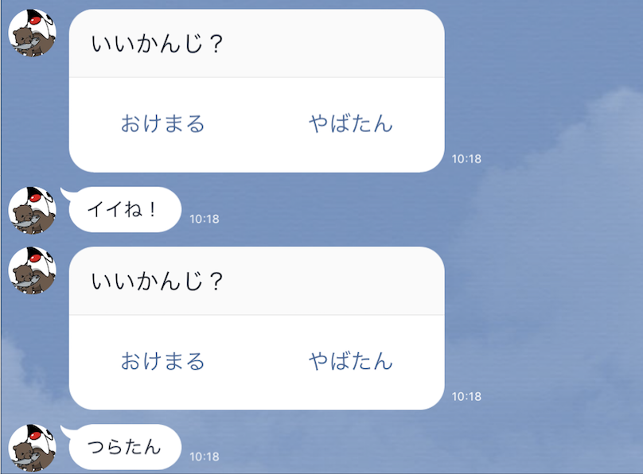

## 確認画面を表示し、ユーザの回答に対応する

Botから確認画面を表示して、ユーザ側の返答に対応する。

### Pushクラスを変更

pushクラスに確認画面をpush送信するメソッドを作成する。

```java
package com.example.linebot;

import com.linecorp.bot.client.LineMessagingClient;
import com.linecorp.bot.model.PushMessage;
import com.linecorp.bot.model.action.PostbackAction;
import com.linecorp.bot.model.message.Message;
import com.linecorp.bot.model.message.TemplateMessage;
import com.linecorp.bot.model.message.TextMessage;
import com.linecorp.bot.model.message.template.ConfirmTemplate;
import com.linecorp.bot.model.response.BotApiResponse;
import org.slf4j.Logger;
import org.slf4j.LoggerFactory;
import org.springframework.beans.factory.annotation.Autowired;
import org.springframework.scheduling.annotation.Scheduled;
import org.springframework.web.bind.annotation.GetMapping;
import org.springframework.web.bind.annotation.RestController;

import javax.servlet.http.HttpServletRequest;
import java.time.LocalDateTime;
import java.time.format.DateTimeFormatter;
import java.util.concurrent.ExecutionException;

@RestController
public class Push {

  // ------------ 中略・変更なし ------------ 
    
  // 確認メッセージをpush
  @GetMapping("confirm")
  public String pushConfirm() {
    String text = "質問だよ";
    try {
      Message msg = new TemplateMessage(text,
        new ConfirmTemplate("いいかんじ？",
          new PostbackAction("おけまる", "CY"),
          new PostbackAction("やばたん", "CN")));
      PushMessage pMsg = new PushMessage(userId, msg);
      BotApiResponse resp = client.pushMessage(pMsg).get();
      log.info("Sent messages: {}", resp);
    } catch (InterruptedException | ExecutionException e) {
      throw new RuntimeException(e);
    }
    return text;
  }

}
```

### 動作確認

LineBotApplication を一度停止して、再起動する。

[http://localhost:8080/confirm](http://localhost:8080/confirm) にブラウザでアクセスし、ブラウザに`質問だよ`と表示されることを確認する。同時に、LINEBotが「いいかんじ？」と質問を発言していることを確認する。


いまはこれに回答しても何もおこらない。回答するための処理を、今度はCallbackクラスに追加する。

### Callbackクラスを変更

Callbackクラスに、ユーザが回答した内容に対応して動作を変えるメソッドを追加する。

```java
package com.example.linebot;

import com.linecorp.bot.model.event.Event;
import com.linecorp.bot.model.event.FollowEvent;
import com.linecorp.bot.model.event.MessageEvent;
import com.linecorp.bot.model.event.PostbackEvent;
import com.linecorp.bot.model.event.message.TextMessageContent;
import com.linecorp.bot.model.message.ImageMessage;
import com.linecorp.bot.model.message.Message;
import com.linecorp.bot.model.message.TextMessage;
import com.linecorp.bot.spring.boot.annotation.EventMapping;
import com.linecorp.bot.spring.boot.annotation.LineMessageHandler;
import org.slf4j.Logger;
import org.slf4j.LoggerFactory;
import org.springframework.boot.web.client.RestTemplateBuilder;
import org.springframework.web.client.HttpClientErrorException;
import org.springframework.web.client.RestTemplate;

import java.net.URI;
import java.time.LocalTime;
import java.util.Random;

@LineMessageHandler
public class Callback {

  // ------------ 中略・変更なし ------------ 

  // PostBackEventに対応する
  @EventMapping
  public Message handlePostBack(PostbackEvent event) {
    String actionLabel = event.getPostbackContent().getData();
    switch (actionLabel) {
      case "CY":
        return reply("イイね！");
      case "CN":
        return reply("つらたん");
      default:
        return reply("?");
    }
  }

}
```

### 動作確認

LineBotApplication を一度停止して、再起動する。

[http://localhost:8080/confirm](http://localhost:8080/confirm にブラウザでアクセスし、ブラウザに`質問だよ`と表示されることを確認する。同時に、LINEBotが「いいかんじ？」と質問を発言していることを確認する。

ユーザが選択肢を選んで回答すると、Botがその選択肢に対応して異なる返答をする。



### 解説と補足

- 確認ダイアログのような、ユーザーが回答や操作できるものはテンプレートメッセージ（`TemplateMessage`）として構成される（[公式のドキュメント：テンプレートメッセージ](https://developers.line.me/ja/docs/messaging-api/reference/#anchor-b920b618f88811c039983809a42a46480e8f237f))。
- ユーザが回答に使える選択肢には ポストバックアクション（`PostBackAction`) を利用する。これにより、表示される文字列とは別に、何を押されたかが判断できるパラメータ(`data`）を送信できる。
- ユーザが選択肢を回答すると、Callback クラスに ポストバックイベント（`PostBackEvent`） が送信される。<br>Callbackクラスではこれに対応するメソッドを用意して、何を押されたかが判断できるパラメータの値で、Botの動作（回答内容）を変えている。<br>他にも、ユーザにWebサイトを表示させる `URIAction` 、日付を入力させる `DateTimePickerAction` が存在する。<br>詳細はリッチメニューの項で解説している。
- TemplateMessageは、Callback クラスでのユーザからの返答時に表示することもできる。<br>（ユーザが何かメッセージを送り、その返答に確認ウィンドウを出す）<br>その場合、Callback クラスのフィールド変数として `LineMessageClient` とそのインジェクション（`@Autowired`)が必要になる
- `@GetMapping("confirm")`は、ブラウザから実行するためのテスト用なので、実際に開発するときには削除してもよい（スケジュール機能などで実行する）

-----

[戻る](../README.md)
