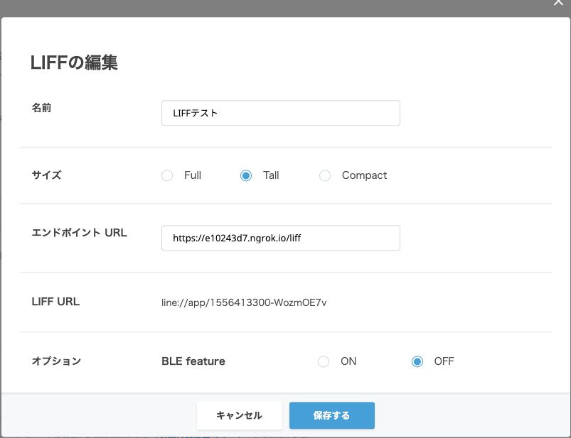
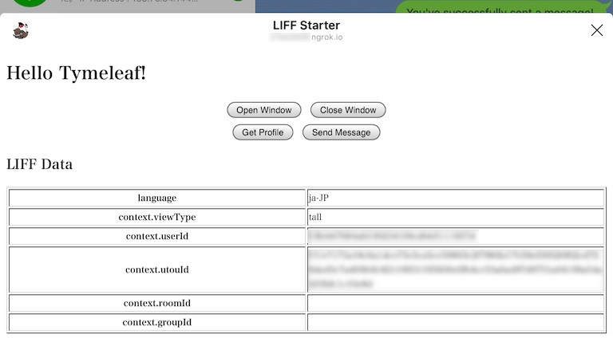
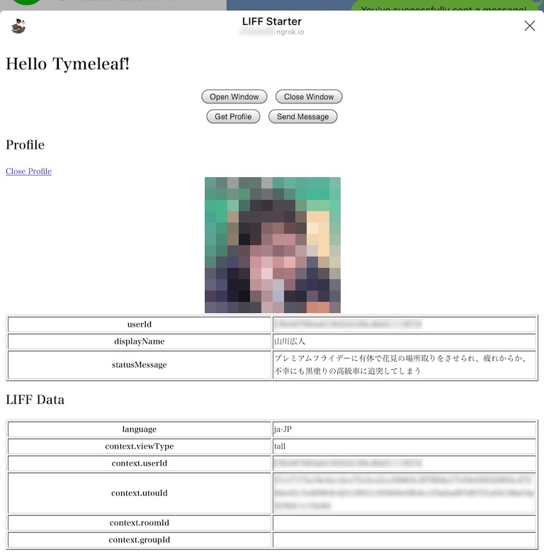

## LIFFを動かす

LIFFの詳細は[公式のドキュメント:LINE Front-end Framework](https://developers.line.me/ja/docs/liff/)を参照されたい。

LIFFは、別途に用意したWebページやフォームをLINE Bot内部に表示できるようにする。これにより、LINEクライアントが用意するUIだけでは実現できない複雑な入力やWebアプリとの連携ができるようになる。

ここでは、

1. ライブラリにThymeleafを追加する
2. Spring BootでThymeleafのWebページを表示する
3. LIFFのサンプルを表示する

の手順で進める。

### 1. ライブラリにThymeleafを追加する

プロジェクトファイル（ルートフォルダ）の pom.xml の `<properties>〜</properties>` の中に、Thymeleafの記述を追加する。

```xml
<properties>
  (中略）
  <thymeleaf.version>3.0.11.RELEASE</thymeleaf.version>
  <thymeleaf-layout-dialect.version>2.4.1</thymeleaf-layout-dialect.version>
</properties>
```

プロジェクトファイル（ルートフォルダ）の pom.xml の `<dependencies>〜</dependencies>` の中に、Thymeleafの記述を追加する。（spring-boot-starter-webの下あたり）

```xml
<dependencies>
  （中略）
  <dependency>
    <groupId>org.springframework.boot</groupId>
    <artifactId>spring-boot-starter-thymeleaf</artifactId>
  </dependency>
  （中略）
</dependencies>
```

その他のソース（src/main/resources）の application.properties の末尾に、Thymeleafの設定を追加する

```properties
## thymeleaf
spring.thymeleaf.mode=HTML
```


### 2. Spring BootでThymeleafのWebページを表示する

#### ファイルの作成

その他のソース（src/main/resources）の templates フォルダの中に liff.html を作成する<br>（フォルダがない場合は作成する）

```html
<!DOCTYPE html>
<html xmlns:th="http://www.thymeleaf.org">
<head>
  <meta charset="UTF-8" />
  <title>Hello Thymeleaf</title>
</head>
<body>
<h1>[[${test}]]</h1>
</body>
</html>
```

ソース・パッケージ（src/main/java）に com.example.linebot.web パッケージを作成し、その中に LIFFController クラスを作成する
 
```java
package com.example.linebot.web;

import org.springframework.stereotype.Controller;
import org.springframework.ui.Model;
import org.springframework.web.bind.annotation.GetMapping;

@Controller
public class LIFFController {

  @GetMapping("/liff")
  public String hello(Model model) {
    // [[${test}]] の部分を Hello... で書き換えて、liff.htmlを表示する
    model.addAttribute("test", "Hello Tymeleaf!");
    return "liff";
  }

}
```

#### Thymeleafの動作確認

1. LineBotApplication を一度停止して、再起動する
2. [http://localhost:m8080/liff](http://localhost:8080/liff) にアクセスする
3. ブラウザに下のように表示されることを確認する<br><br>これは、 liff.html の`[[${test}]]`の部分を、 LIFFController で書き換えている。


### 3. LIFFのサンプルを表示する

#### ファイルの作成

[line/line-liff-starter](https://github.com/line/line-liff-starter) のサンプルコードを（少し変更して）動作させる。

上記のサイトの liff-starter.js と style.css をコピーして、その他のソース（src/main/resources）の static フォルダの中に複製する<br>（フォルダがない場合は作成する）

上記のサイトの index.html の内容をもとに、その他のソース（src/main/resources）の templates/liff.html を書き換える。

```html
<!DOCTYPE html>
<html xmlns:th="http://www.thymeleaf.org">
<!-- The html based on https://github.com/line/line-liff-starter/blob/master/index.html -->
<head>
  <meta name="viewport" content="width=device-width, initial-scale=1.0">
  <title>LIFF Starter</title>
  <link rel="stylesheet" href="style.css">
</head>

<body>

<h1>[[${test}]]</h1>

<div class="buttongroup">
  <div class="buttonrow">
    <button id="openwindowbutton">Open Window</button>
    <button id="closewindowbutton">Close Window</button>
  </div>
  <div class="buttonrow">
    <button id="getaccesstoken">Get Access Token</button>
    <button id="getprofilebutton">Get Profile</button>
    <button id="sendmessagebutton">Send Message</button>
  </div>
</div>

<div id="accesstokendata">
  <h2>Access Token</h2>
  <a href="#" onclick="toggleAccessToken()">Close Access Token</a>
  <table border="1">
    <tr>
      <th>accessToken</th>
      <td id="accesstokenfield"></td>
    </tr>
  </table>
</div>

<div id="profileinfo">
  <h2>Profile</h2>
  <a href="#" onclick="toggleProfileData()">Close Profile</a>
  <div id="profilepicturediv">
  </div>
  <table border="1">
    <tr>
      <th>userId</th>
      <td id="useridprofilefield"></td>
    </tr>
    <tr>
      <th>displayName</th>
      <td id="displaynamefield"></td>
    </tr>
    <tr>
      <th>statusMessage</th>
      <td id="statusmessagefield"></td>
    </tr>
  </table>
</div>

<div id="liffdata">
  <h2>LIFF Data</h2>
  <table border="1">
    <tr>
      <th>language</th>
      <td id="languagefield"></td>
    </tr>
    <tr>
      <th>context.viewType</th>
      <td id="viewtypefield"></td>
    </tr>
    <tr>
      <th>context.userId</th>
      <td id="useridfield"></td>
    </tr>
    <tr>
      <th>context.utouId</th>
      <td id="utouidfield"></td>
    </tr>
    <tr>
      <th>context.roomId</th>
      <td id="roomidfield"></td>
    </tr>
    <tr>
      <th>context.groupId</th>
      <td id="groupidfield"></td>
    </tr>
  </table>
</div>

<script src="https://d.line-scdn.net/liff/1.0/sdk.js"></script>
<script src="liff-starter.js"></script>
</body>
</html>
```

#### LIFFアプリとして追加する

Message APIの設定画面 から、LIFF を選択し、追加ボタンを押す


表示された LIFFの追加 画面に必要事項を入力する

- **名前** LIFFアプリを識別する名前。今回は仮に `LIFFテスト` とする。
- **サイズ** どれかを選ぶ。これによって、LINEアプリ上に表示されるLIFFアプリウィンドウのサイズが変わる。
- **エンドポイントURL** 作成したLIFFアプリの（外部からアクセス可能な）URLを入力する。今回であれば、`https://xxx.ngrok.io/liff` になる。
- **オプション** 今回はデフォルト（OFF）でよい。



LIFEの情報が設定される。
発行された LIFF URL（例：`line://app/0000000000-nnnnnnnn`）がBotとの会話で実行（開かれる）と、LIFFアプリが起動する。


<!--
LIFFアプリを追加するために、下のコマンドを端末（ターミナル）から実行する。

Windowsの場合はcurlをインストールするか、同等のパラメータでHTTPリクエストが行えるツール（[ARC](https://chrome.google.com/webstore/detail/advanced-rest-client/hgmloofddffdnphfgcellkdfbfbjeloo?hl=ja)など）を利用する。<br>また、[line/line-bot-sdk-java](https://github.com/line/line-bot-sdk-java/) には、Javaで動作するLIFF/リッチメニュー登録用のコマンドラインツール([line-bot-cli](https://github.com/line/line-bot-sdk-java/tree/master/line-bot-cli))も用意されている。

コマンドを実行する場合、以下の部分は個別に編集が必要。

- `"Authorization: Bearer xxxxxx..."` の `xxxxxx...` には、Botのアクセストークン（ロングターム）の値を改行なしで貼り付ける（ので、コマンドがとても長くなる）
- `"https://xxx.ngrok.io/liff"` の `xxx.ngrok.io` は、ngrokで取得したURLにする
- `Type` には `compact`, `tall` , `full`　の三種類があり、LIFFアプリのウィンドウの高さを決める
- `url` は https のURLを指定する

```sh
curl -XPOST \
-H "Authorization: Bearer xxxxxx..." \
-H "Content-Type: application/json" \
-d '{
    "view": {
        "type": "tall",
        "url": "https://xxx.ngrok.io/liff"
    }
}' \
https://api.line.me/liff/v1/apps
```

成功すれば、liffIdが返信される。

```
{"liffId":"0000000000-nnnnnnnn"}%
```
-->

#### LIFFアプリの動作確認

**必ずスマートフォン（タブレット）のLINEアプリで動作確認してください（本稿執筆時点でPC版は対応していない）**

<~--
上記の手順で取得した liffId をもとに、アプリにアクセスするURLを作成する。

URLは、 `line://app/` と liffId を結合した `line://app/0000000000-nnnnnnnn` となる。
-->

本来はLIFEアプリの起動トリガとなる行動にあわせてBotがユーザにLIFE URLを発話すれば良いが、ここでは簡易的な動作確認のため、自分でURLを投稿する。


自分が投稿したURL、もしくはBotがオウム返ししたURLをクリックすると、下のようにLIFFアプリが表示される。<br>特に、Thymeleafにより `Hello Thymeleaf!` を表示していること、LIFF APIにより表の中の`language`, `context.viewType`, `context.userId`, `context.utouId` などの項目に値が表示されていることを確認する。 



`Open window` ボタンを押すと、アプリ内ブラウザでlineのホームページが表示される。

`Get profile` ボタンを押すと、自分のLINEに設定しているアイコンとプロフィールが表示される。



`Send Message` ボタンを押すと、メッセージを送信した旨のダイアログが表示され、自分に `You've successfully sent a message! Hooray!` というメッセージと、スタンプが表示される。


このように、LIFFアプリを用いると、LINEのWebサイトにLINEの情報を連携させたり、Webサイト側からLINEのクライアントにイベントを発生させることができる。

**Note（2019-07-17）:** liff-starter.js が古いスタンプコードを利用しているため、スタンプが表示されない。スタンプの表示も確認したい場合は、 liff-starter.js の以下の部分を[新しいスタンプコード](https://developers.line.biz/media/messaging-api/sticker_list.pdf)に書き換える。

```javascript
            type: 'sticker',
            packageId: '11537',
            stickerId: '52002734'
```

#### LIFFアプリの削除

Message APIの設定画面 から、LIFF を選択し、削除したいLIFFアプリのゴミ箱ボタンを押す。

<!--
追加したLIFFアプリを削除するには、下のコマンドを端末（ターミナル）から実行する。

- `0000000000-nnnnnnnn` の部分は、 liffId と置き換える 
- `"Authorization: Bearer xxxxxx..."` の `xxxxxx...` の部分には、Botのアクセストークン（ロングターム）の値を改行なしで貼り付ける

```sh
curl -X DELETE https://api.line.me/liff/v1/apps/0000000000-nnnnnnnn \
-H "Authorization: Bearer xxxxxx..."
```

成功すれば何も表示されない。（失敗時にはエラーメッセージが表示される）
-->

-----

[戻る](../../README.md)
